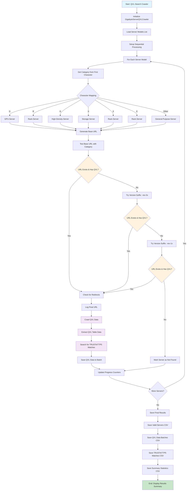

# QVL-Search Crawler Flow Diagram



## Key Features

### Sequential Flow (Ver3+)
- **Detect → Crawl → Next**: Each server is processed individually
- **Immediate Processing**: Valid servers are crawled immediately after detection
- **Efficient Resource Usage**: No need to store large lists in memory

### Smart URL Generation (Ver4)
- **Character-Based Categorization**: Determines server category from first character
- **Redirect Detection**: Logs actual final URL after redirects
- **Version Suffix Fallback**: Tries `-rev-3x` and `-rev-1x` if base URL fails
- **Reduced HTTP Requests**: ~60-70% fewer requests compared to brute-force approach

### Data Processing
- **QVL Table Extraction**: Parses HTML tables from server support pages
- **TRUSTA/T7P5 Detection**: Searches for specific SSD compatibility
- **Batch Processing**: Saves data in manageable chunks
- **Multiple Output Formats**: CSV files for different data types

### Error Handling
- **Selenium WebDriver Management**: Automatic driver setup and cleanup
- **Rate Limiting**: Random delays between requests
- **Exception Handling**: Graceful handling of network and parsing errors
- **Progress Tracking**: Real-time status updates and counters
```
